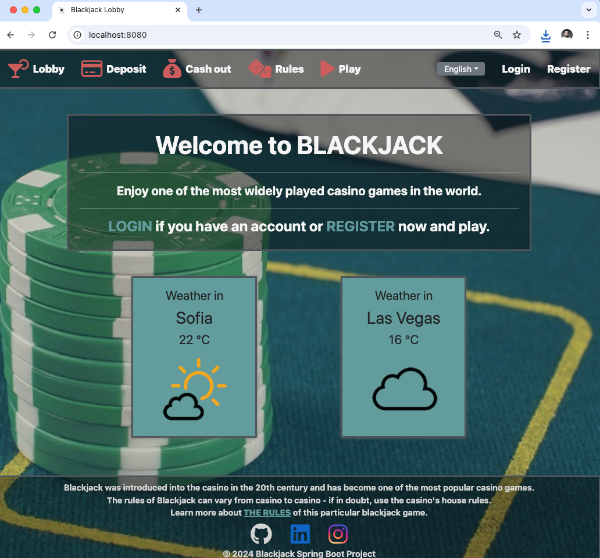
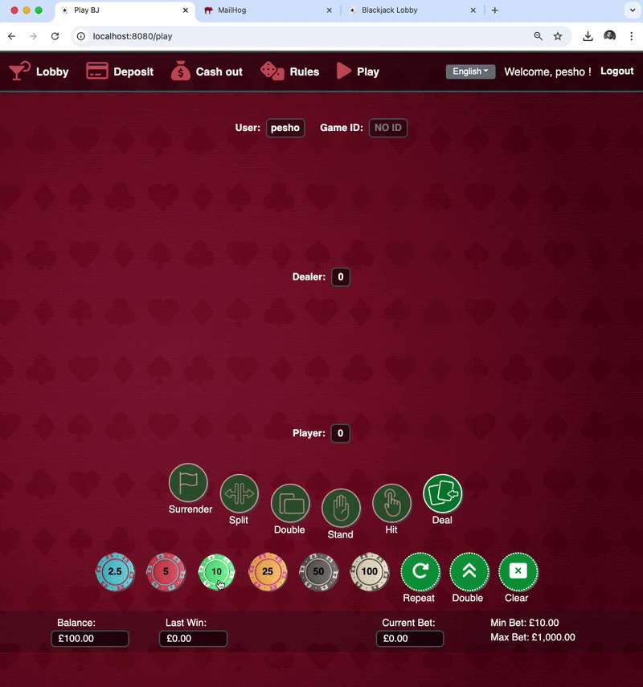
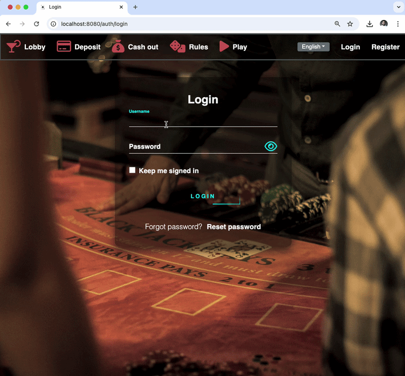

# Blackjack

## Overview

A comprehensive Spring Boot web application that simulates a Blackjack casino game with complete user management, credit
card processing, email verification, and internationalization support. The application follows MVC architecture with
Spring Security for authentication and authorization.

<div align="center">
  
</div>

<div align="center">
  
</div>

## Core Features

### Game Features
- **Full Blackjack Game Logic** - Complete implementation with standard Blackjack rules including:
  - Hit, Stand, Double Down, Split, Surrender 
  - Insurance and Even Money options 
  - Dealer plays until soft 17 
  - Natural Blackjack payouts (2.5:1)
  - Insurance pays 2:1 
- **Betting System** - Minimum bet 10.00, maximum 1,000.00 
- **Game History** - Track all played games with bet history 
- **Persistent Game State** - Incomplete games are saved and can be resumed

### User Management
- **Registration System** - New user registration with validation 
- **Email Verification** - Account activation via email confirmation 
- **Password Reset** - Forgot password functionality with email reset links 
- **Profile Management** - User profiles with personal information 
- **Role-Based Access** - REGULAR, MODERATOR, ADMIN roles

<div align="center">
  
</div>

<div align="center">
  
</div>

### Payment System
- **Credit Card Registration** - Store multiple credit cards (max 3 per user)
- **Deposit Functionality** - Add funds to user wallet
- **Card Verification** - Luhn algorithm validation, expiration date checking
- **Supported Cards** - Visa, Mastercard, American Express, Discover, Troy
- 
<div align="center">
  
</div>

### Security Features
- **Spring Security** - Comprehensive security configuration
- **Remember Me** - Persistent login functionality
- **CSRF Protection** - Enabled for all forms
- **Password Encoding** - BCrypt password hashing
- **reCAPTCHA Integration** - Google reCAPTCHA v2 for form protection

### Internationalization
- **Multi-Language Support** - English and Bulgarian (български)
- **Locale Switching** - Cookie-based language preferences
- **Dynamic Content** - All user-facing text can be internationalized

### Email System
- **Registration Emails** - Account activation links
- **Password Reset Emails** - Secure password reset tokens
- **HTML Email Templates** - Responsive email designs using Thymeleaf
- **MailHog Integration** - Email testing during development

## Technical Stack
### Backend
- **Framework**: Spring Boot 3.2.9 
- **Security**: Spring Security 6.x 
- **Database**: MySQL with Hibernate JPA 
- **Migration**: Liquibase for database version control 
- **Email**: JavaMailSender with SMTP support 
- **Validation**: Hibernate Validator with custom annotations 
- **Template Engine**: Thymeleaf 
- **HTTP Client**: RestTemplate and WebClient

### Frontend
- **Templating**: Thymeleaf with Spring Security integration
- **CSS Framework**: Custom CSS with responsive design
- **JavaScript**: Client-side form validation and AJAX calls
- **reCAPTCHA**: Google reCAPTCHA integration

### Build & Deployment
- **Build Tool**: Gradle
- **Containerization**: Docker support for MySQL and MailHog
- **Java Version**: 17

## Architecture Highlights

### Design Patterns
- **MVC Patter**n - Clear separation of concerns (Controllers, Services, Repositories)
- **Dependency Injection** - Spring IoC container management
- **Event-Driven** - Application events for user registration and password reset
- **DTO Pattern** - Data transfer objects between layers
- **Repository Pattern** - Data access abstraction with Spring Data JPA
- **Chain of Responsibility Pattern** - Game logic engine

### Key Components
#### Configuration Classes
- `SecurityConfig` - Spring Security configuration
- `I18nConfig` - Internationalization setup
- `MailConfig` - Email configuration
- `RecaptchaConfig` - Google reCAPTCHA settings
- `WebConfig` - Web MVC configuration

#### Service Layer
- `GameService` - Core game logic implementation
- `UserService` - User management operations
- `CreditCardService` - Payment processing 
- `WalletService` - Balance management 
- `MailService` - Email communications 
- `UserTokenService` - Token generation and validation 
- `RecaptchaService` - CAPTCHA verification

#### Custom Validations
- `@UniqueEmail` / `@UniqueUsername` - Duplicate checking 
- `@CustomCreditCardNumber` - Card number validation 
- `@FutureExpirationDate` - Expiry date validation 
- `@MinAge` - Age restriction (18+)
- `@FieldMatch` - Password confirmation matching

### Database Schema
### Core Entities
- `users` - User account information 
- `roles` - User roles for authorization 
- `wallets` - User balances and betting amounts 
- `credit_cards` - Registered credit cards 
- `last_games` - Current incomplete game sessions 
- `played_games` - Game history 
- `bet_history` - Betting records 
- `activation_tokens` - Email verification tokens 
- `reset_pass_tokens` - Password reset tokens

### API Endpoints
### Public Endpoints
- `/` - Home page
- `/auth/login` - Login page
- `/auth/register` - Registration page
- `/auth/reset` - Password reset request
- `/rules` - Game rules
- `/test/**` - Testing endpoints

### Protected Endpoints
- `/play/**` - Gameplay endpoints
- `/credit-card/**` - Credit card management
- `/auth/activation` - Account activation
- `/auth/reset_pass` - Password reset

## Running the Application
### Prerequisites
- Java 17+ 
- Docker (optional, for MySQL/MailHog)
- MySQL database (if not using Docker)

### Quick Start with Docker
```shell
cd /path/to/BJ
open -a docker

# Start MySQL and MailHog containers
docker-compose up -d

jenv global 17
# Run the Spring Boot application
./gradlew bootRun
```

### Access Points
- Application: http://localhost:8080
- MailHog UI: http://localhost:8025 (for viewing emails)
- MySQL: localhost:3306

### Configuration Properties
Key configuration options in `application.properties`:

```yml
# Database
spring.datasource.url=jdbc:mysql://localhost:3306/bjdb

# Email
mail.host=localhost
mail.port=1025

# reCAPTCHA
google.recaptcha.enabled=true

# Authentication
auth.register.auto-login=false
auth.login.remember-me-key=your-secret-key

# Token expiration
auth.activation-token.expires-after-minutes=60
auth.forgot-password-token.expires-after-minutes=30
```

```shell
docker container rm -f $(docker container ls -aq)
```

### Testing
### Test Accounts
After registration, users need to confirm their email address before logging in (unless auto-login is enabled).

### Email Testing
- Use MailHog UI (port 8025) to view all sent emails
- No real SMTP server required for development

### Game Testing
- Minimum bet: $10
- Maximum bet: $1000
- Register a credit card before depositing funds
- Use test card numbers (follow Luhn algorithm)

### Security Considerations
- Passwords are BCrypt-encoded
- SQL injection prevention using JPA/Hibernate
- CSRF protection enabled
- XSS prevention through Thymeleaf auto-escaping
- Session fixation protection
- Secure remember-me token storage

### Future Enhancements
Potential improvements:

- Multi-table Blackjack support
- Tournament mode
- Leaderboards and achievements
- Mobile-responsive design optimization
- WebSocket for real-time updates
- Caching for improved performance
- API documentation with Swagger/OpenAPI
- Unit and integration test coverage

### License
This project is for educational purposes. Use responsibly.

This response is AI-generated and for reference purposes only.

